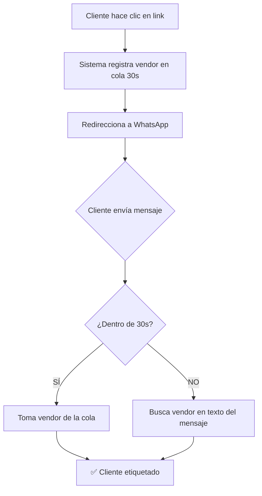

# 🏷️ SISTEMA VENDOR PRETAG - DOCUMENTACIÓN COMPLETA

> **Sistema de etiquetado automático de vendors para clientes WhatsApp**  
> **Fecha:** Enero 2025  
> **Estado:** Producción ✅

---

## 📋 ÍNDICE

- [🎯 ¿QUÉ ES EL SISTEMA VENDOR PRETAG?](#-qué-es-el-sistema-vendor-pretag)
- [🔧 CÓMO FUNCIONA](#-cómo-funciona)
- [📱 CÓMO CREAR LINKS PARA CLIENTES](#-cómo-crear-links-para-clientes)
- [🛡️ SISTEMA DE DOBLE PROTECCIÓN](#️-sistema-de-doble-protección)
- [⚙️ IMPLEMENTACIÓN TÉCNICA](#️-implementación-técnica)
- [📝 EJEMPLOS REALES](#-ejemplos-reales)
- [🔍 TROUBLESHOOTING](#-troubleshooting)

---

## 🎯 ¿QUÉ ES EL SISTEMA VENDOR PRETAG?

El **Sistema Vendor Pretag** permite **etiquetar automáticamente** conversaciones de WhatsApp con códigos de referencia específicos **ANTES** de que el cliente envíe su primer mensaje.

### **Problema que resuelve:**
- Los clientes necesitan **rastrear** de dónde vienen sus leads
- Cada **agente/vendedor/campaña** necesita su propio código de seguimiento
- El sistema debe **etiquetar automáticamente** sin intervención manual

### **Solución:**
- **Links especiales** que registran el vendor y redirigen a WhatsApp
- **Doble protección:** Cola temporal + detección por texto
- **Ventana de 30 segundos** para registrar el vendor automáticamente

---

## 🔧 CÓMO FUNCIONA

### **🔄 FLUJO COMPLETO:**



### **⚡ COMPONENTES TÉCNICOS:**

1. **Endpoint:** `/vendor-pretag`
2. **Cola temporal:** `PENDING_VENDOR_QUEUE` (TTL: 30 segundos)
3. **Regex detector:** `VENDOR_TEXT_REGEX` para detección en texto
4. **Lock de sincronización:** `PENDING_VENDOR_LOCK`

---

## 📱 CÓMO CREAR LINKS PARA CLIENTES

### **🎯 PLANTILLA UNIVERSAL:**

```
https://[DOMINIO_CLIENTE]/vendor-pretag?vendor=[CODIGO_COMPLETO]&next=https://wa.me/[NUMERO_WHATSAPP]?text=[CODIGO_COMPLETO]
```

### **📋 PASOS PARA CREAR UN LINK:**

#### **1️⃣ IDENTIFICAR DATOS DEL CLIENTE:**
- **Dominio Render:** `https://[cliente]-[proyecto].onrender.com`
- **Número WhatsApp:** Formato internacional sin símbolos `549XXXXXXXXX`
- **Código vendor:** El código exacto que quieren para tracking

#### **2️⃣ ARMAR EL LINK:**

**EJEMPLO REAL - CLIENTE BIM:**
- **Dominio:** `https://fabian-calcagno-home-of-bim-opticonnecta.onrender.com`
- **WhatsApp:** `+54 9 11 6258-9021` → `5491162589021`
- **Código:** `/?ref=da5833`

**LINK RESULTANTE:**
```
https://fabian-calcagno-home-of-bim-opticonnecta.onrender.com/vendor-pretag?vendor=/?ref=da5833&next=https://wa.me/5491162589021?text=/?ref=da5833
```

#### **3️⃣ VERIFICAR COMPONENTES:**

✅ **vendor=** → Código exacto que se guardará en el sistema  
✅ **next=** → URL de WhatsApp con el número correcto  
✅ **text=** → Mismo código para doble protección  

---

## 🛡️ SISTEMA DE DOBLE PROTECCIÓN

### **🎯 ¿POR QUÉ DOBLE PROTECCIÓN?**

El sistema tiene **DOS mecanismos** para garantizar el etiquetado:

#### **🚀 PROTECCIÓN 1 - COLA TEMPORAL (Primarios 30s):**
- Cliente hace clic → Código se guarda en `PENDING_VENDOR_QUEUE`
- Cliente envía mensaje **dentro de 30s** → Sistema toma de la cola
- **Ventaja:** Funciona aunque el cliente escriba cualquier cosa

#### **🛡️ PROTECCIÓN 2 - DETECCIÓN POR TEXTO (Respaldo):**
- Cliente envía el **código exacto** como texto
- Sistema detecta con `VENDOR_TEXT_REGEX`
- **Ventaja:** Funciona aunque pasen los 30 segundos

### **📊 ESCENARIOS DE USO:**

| Escenario | Tiempo | Texto Enviado | ¿Se Etiqueta? | Método |
|-----------|--------|---------------|---------------|---------|
| Cliente rápido | <30s | "Hola" | ✅ SÍ | Cola |
| Cliente rápido | <30s | "/?ref=da5833" | ✅ SÍ | Cola |
| Cliente lento | >30s | "Hola" | ❌ NO | - |
| Cliente lento | >30s | "/?ref=da5833" | ✅ SÍ | Regex |

---

## ⚙️ IMPLEMENTACIÓN TÉCNICA

### **🔧 ENDPOINT `/vendor-pretag`:**

**Ubicación:** `main.py` líneas 2069-2139

```python
@app.route('/vendor-pretag', methods=['GET', 'POST', 'OPTIONS'])
def vendor_pretag():
    # Parámetros: vendor, next, phone (opcional)
    # Funciones:
    # 1. Registrar en cola temporal (30s TTL)
    # 2. Redirigir a WhatsApp
    # 3. Manejar CORS para landings externas
```

### **🔄 VARIABLES CLAVE:**

```python
# En main.py líneas 47-50
PENDING_VENDOR_QUEUE = deque()  # Cola FIFO
PENDING_VENDOR_LOCK = Lock()    # Sincronización
PENDING_VENDOR_TTL_SECONDS = 30 # Tiempo de vida
```

### **🔍 REGEX DETECTOR:**

```python
# En main.py líneas 55-58
VENDOR_TEXT_REGEX = re.compile(
    r"(?:#?\s*(?:AGT|AGENTE|VENDEDOR)\s*[=:]\s*|CLIENTE\s*DE\s*:)[\s\-]*([A-ZÁÉÍÓÚÑ0-9 ._\-]{2,40})",
    flags=re.IGNORECASE
)
```

**⚠️ IMPORTANTE:** Este regex detecta códigos alfanuméricos de 2-40 caracteres.

---

## 📝 EJEMPLOS REALES

### **🏢 CLIENTE: BIM (Home of BIM)**

**Datos del cliente:**
- **Empresa:** Fabian Calcagno - Home of BIM
- **Dominio:** `https://fabian-calcagno-home-of-bim-opticonnecta.onrender.com`
- **WhatsApp:** `+54 9 11 6258-9021` → `5491162589021`
- **Sistema:** OptiAtiende-IA

**Códigos solicitados:**
1. `/?ref=884942`
2. `/?ref=da5833`

**Links generados:**

```bash
# Para código 884942
https://fabian-calcagno-home-of-bim-opticonnecta.onrender.com/vendor-pretag?vendor=/?ref=884942&next=https://wa.me/5491162589021?text=/?ref=884942

# Para código da5833  
https://fabian-calcagno-home-of-bim-opticonnecta.onrender.com/vendor-pretag?vendor=/?ref=da5833&next=https://wa.me/5491162589021?text=/?ref=da5833
```

### **🎯 PLANTILLA PARA NUEVOS CLIENTES:**

```bash
# PASO 1: Identificar datos
DOMINIO="https://[cliente-proyecto].onrender.com"
WHATSAPP="549XXXXXXXXX"  # Sin + ni espacios ni guiones
CODIGO="[codigo-exacto]"  # Como lo quiere el cliente

# PASO 2: Armar link
https://[DOMINIO]/vendor-pretag?vendor=[CODIGO]&next=https://wa.me/[WHATSAPP]?text=[CODIGO]
```

---

## 🔍 TROUBLESHOOTING

### **❌ PROBLEMAS COMUNES:**

#### **1. "No se está etiquetando el vendor"**
**Posibles causas:**
- ✅ **Verificar que el endpoint existe:** `[dominio]/vendor-pretag`
- ✅ **Cola expiró (>30s):** Cliente demoró mucho
- ✅ **Regex no detecta:** Código no cumple patrón alfanumérico
- ✅ **Función faltante:** `memory.upsert_vendor_label` no implementada

**Solución:**
1. Verificar logs del servidor
2. Confirmar que el código cumple regex
3. Usar código como texto de respaldo

#### **2. "Redirige al WhatsApp equivocado"**
**Causa:** Número mal formateado en el link

**Solución:**
- ✅ Formato correcto: `5491162589021` (sin + ni espacios)
- ✅ Verificar que el número esté activo

#### **3. "Error CORS en landing externa"**
**Causa:** Landing del cliente no puede acceder al endpoint

**Solución:**
- ✅ Endpoint ya tiene headers CORS configurados
- ✅ Verificar que la landing use HTTPS

### **🔧 DEBUGGING:**

#### **Verificar que el sistema esté funcionando:**
```bash
# Test del endpoint
curl "https://[dominio]/vendor-pretag?vendor=TEST123"

# Debe retornar:
{"ok": true, "persisted": false, "queued": true, "phone": "", "vendor": "TEST123"}
```

#### **Logs importantes a buscar:**
```bash
[VENDOR_PRETAG] phone=- vendor=TEST123 persisted=false queued=true
[VENDOR] ✅ Vendor encontrado en referral 'ref': 'TEST123'
[VENDOR] ✅ Set [numero] -> TEST123
```

---

## 📚 REFERENCIAS TÉCNICAS

### **Archivos involucrados:**
- `main.py` (líneas 47-50, 2069-2139): Endpoint y configuración
- `memory.py`: Persistencia de vendor (función `upsert_vendor_label`)

### **Variables de entorno relacionadas:**
- `D360_API_KEY`: Para API de WhatsApp
- `TENANT_NAME`: Identificación del cliente

### **Dependencias:**
- Flask para el endpoint
- `collections.deque` para la cola
- `threading.Lock` para sincronización
- `re` para detección por regex

---

**✅ FIN DE DOCUMENTACIÓN**

> **Nota:** Mantener este documento actualizado cuando se hagan cambios al sistema.  
> **Última actualización:** Enero 2025 - Cristian Bárbulo
